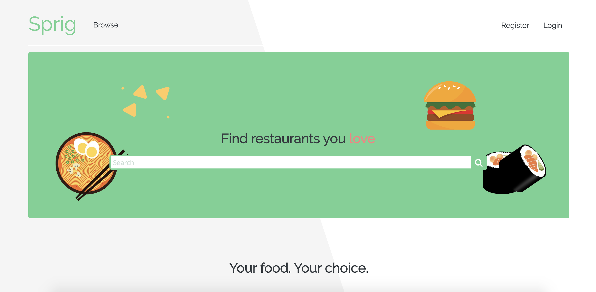
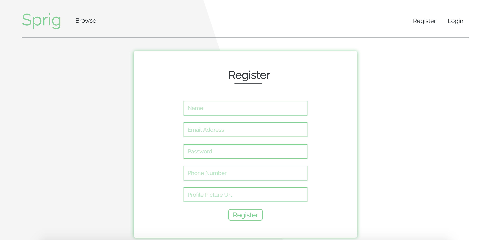
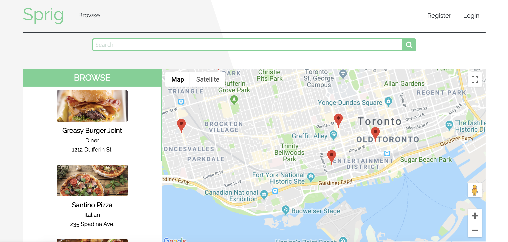

# Sprig Project

Sprig is a full stack web application built with Node and Express that allows users to browse and order from multiple restaurants, using the Google Maps, Google Pay, and Twilio APIs.
Live site available at [sprigapp.herokuapp.com/](https://sprigapp.herokuapp.com/).

## Final Product

## Dependencies

- Node.js
- Express
- EJS
- bcrypt
- body-parser
- cookie-session
- fuzzystrmatch

## APIs

- Google Maps / Pay
- Twilio

## Getting Started

- Install all dependencies (using the `npm install` command).
- Run the development web server using the `npm start` command.
